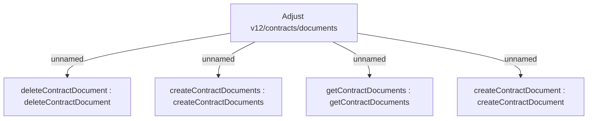

# CLM-4622 Integration to DMS module - COMA - Adjust v12/contracts/documents

```mermaid
graph TD
    createContractDocument_createContractDocument["createContractDocument : createContractDocument"]
    getContractDocuments_getContractDocuments["getContractDocuments : getContractDocuments"]
    createContractDocuments_createContractDocuments["createContractDocuments : createContractDocuments"]
    deleteContractDocument_deleteContractDocument["deleteContractDocument : deleteContractDocument"]
    Adjust_v12_contracts_documents["Adjust v12/contracts/documents"]
    Adjust_v12_contracts_documents -->|unnamed| deleteContractDocument_deleteContractDocument
    Adjust_v12_contracts_documents -->|unnamed| createContractDocuments_createContractDocuments
    Adjust_v12_contracts_documents -->|unnamed| getContractDocuments_getContractDocuments
    Adjust_v12_contracts_documents -->|unnamed| createContractDocument_createContractDocument
```
