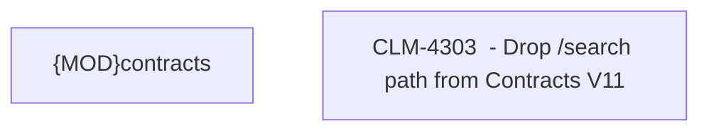

# CLM-4303 - Drop /search path from Contracts V11

- **Diagram Type**: Custom
- **Package**: HomerSelect/BSL/Modules/Contract Management (COMA)/Requirements/CBL-12864/CLM-4303 - Drop /search path from Contracts V11
- **Diagram ID**: 156235
- **Elements**: 2
- **Connectors**: 0

