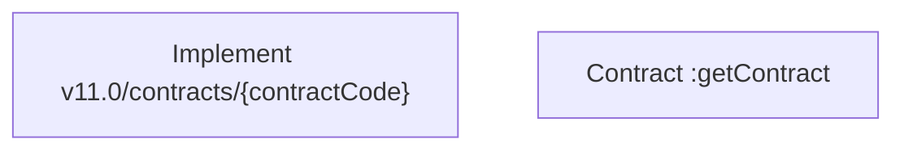

# CLM-4306 - COMA - ContractsV11 Detail Endpoint /v11/contracts/xxxxxxxxx

- **Diagram Type**: Custom
- **Package**: HomerSelect/BSL/Modules/Contract Management (COMA)/Requirements/CBL-12864/CLM-4306 - COMA - ContractsV11 Detail Endpoint /v11/contracts/xxxxxxxxx
- **Diagram ID**: 156236
- **Elements**: 2
- **Connectors**: 0

