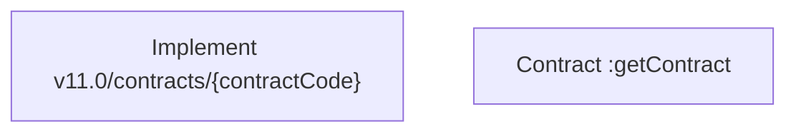

# CLM-4306 - COMA - ContractsV11 Detail Endpoint /v11/contracts/xxxxxxxxx

```mermaid
graph TD
    Implement_v11_0_contracts_contractCode["Implement v11.0/contracts/{contractCode}"]
    Contract_getContract["Contract :getContract"]
```
