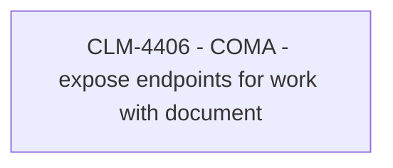

# CLM-4406 - COMA - expose endpoints for work with document

- **Diagram Type**: Custom
- **Package**: HomerSelect/BSL/Modules/Contract Management (COMA)/Requirements/CBL-12864/CLM-4406 - COMA - expose endpoints for work with document
- **Diagram ID**: 156237
- **Elements**: 1
- **Connectors**: 0

