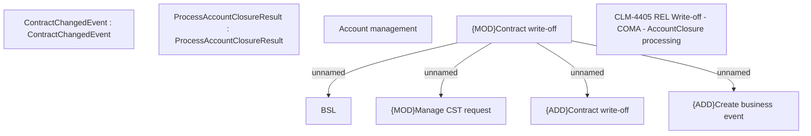

# CLM-4405 - REL Write-off - COMA - AccountClosure processing

- **Diagram Type**: Custom
- **Package**: HomerSelect/BSL/Modules/Contract Management (COMA)/Requirements/CBL-1321/CLM-4405 - REL Write-off - COMA - AccountClosure processing
- **Diagram ID**: 156238
- **Elements**: 9
- **Connectors**: 4

