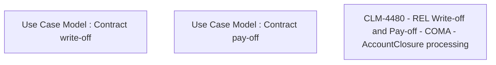

# CLM-4480 - REL Write-off & Pay-off - COMA - AccountClosure processing

```mermaid
graph TD
    Use_Case_Model_Contract_write_off["Use Case Model : Contract write-off"]
    Use_Case_Model_Contract_pay_off["Use Case Model : Contract pay-off"]
    CLM_4480_REL_Write_off_Pay_off_COMA_AccountClosure_processin["CLM-4480 - REL Write-off and Pay-off - COMA - AccountClosure processing"]
```
