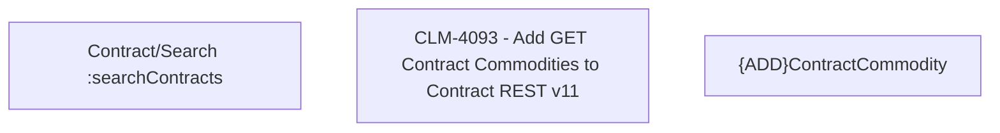

# CBL-14101 (CLM-4093) Add GET Contract Commodities to Contract REST v11

```mermaid
graph TD
    Contract_Search_searchContracts["Contract/Search :searchContracts"]
    CLM_4093_Add_GET_Contract_Commodities_to_Contract_REST_v11["CLM-4093 - Add GET Contract Commodities to Contract REST v11"]
    ADD_ContractCommodity["{ADD}ContractCommodity"]
```
