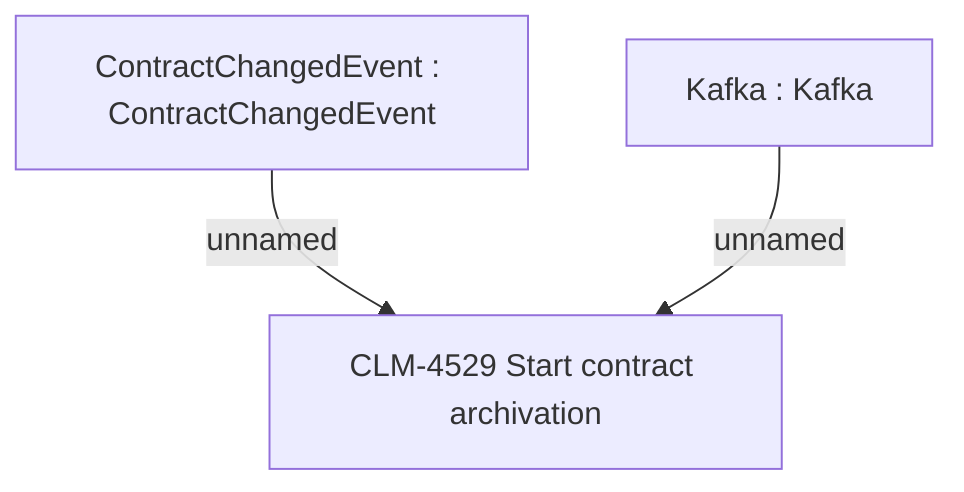

# CBL-14638 (CLM-4433) Cabinet - Contract documents to Central Archive

- **Diagram Type**: Custom
- **Package**: HomerSelect/BSL/Modules/Contract Management (COMA)/Requirements/CBL-14638 (CLM-4433) Cabinet - Contract documents to Central Archive
- **Diagram ID**: 156101
- **Elements**: 3
- **Connectors**: 2

