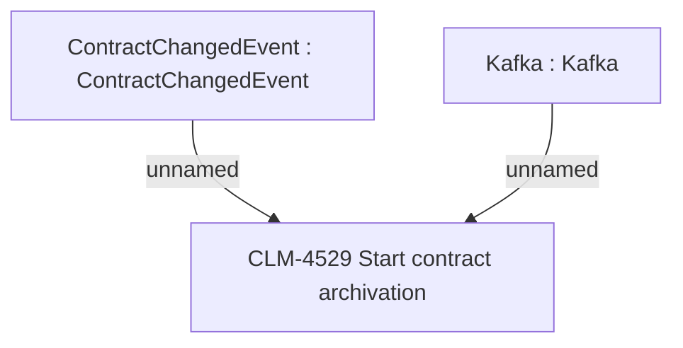

# CBL-14638 (CLM-4433) Cabinet - Contract documents to Central Archive

```mermaid
graph TD
    ContractChangedEvent_ContractChangedEvent["ContractChangedEvent : ContractChangedEvent"]
    Kafka_Kafka["Kafka : Kafka"]
    CLM_4529_Start_contract_archivation["CLM-4529 Start contract archivation"]
    ContractChangedEvent_ContractChangedEvent -->|unnamed| CLM_4529_Start_contract_archivation
    Kafka_Kafka -->|unnamed| CLM_4529_Start_contract_archivation
```
