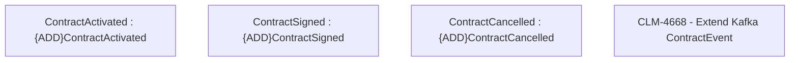

# CLM-4668 - Extend Kafka ContractEvent

- **Diagram Type**: Custom
- **Package**: HomerSelect/BSL/Modules/Contract Management (COMA)/Requirements/CBL-16722/CLM-4668 - Extend Kafka ContractEvent
- **Diagram ID**: 156242
- **Elements**: 4
- **Connectors**: 0

