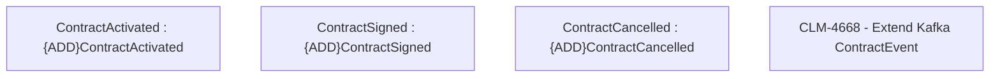

# CLM-4668 - Extend Kafka ContractEvent

```mermaid
graph TD
    ContractActivated_ADD_ContractActivated["ContractActivated : {ADD}ContractActivated"]
    ContractSigned_ADD_ContractSigned["ContractSigned : {ADD}ContractSigned"]
    ContractCancelled_ADD_ContractCancelled["ContractCancelled : {ADD}ContractCancelled"]
    CLM_4668_Extend_Kafka_ContractEvent["CLM-4668 - Extend Kafka ContractEvent"]
```
