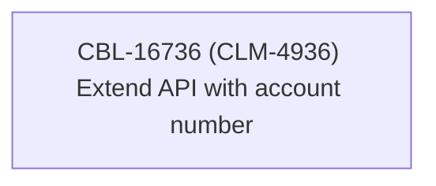

# CBL-16736 (CLM-4936) Extend API with account number

- **Diagram Type**: Custom
- **Package**: HomerSelect/BSL/Modules/Contract Management (COMA)/Requirements/CBL-16736 (CLM-4936) Extend API with account number
- **Diagram ID**: 156103
- **Elements**: 1
- **Connectors**: 0

