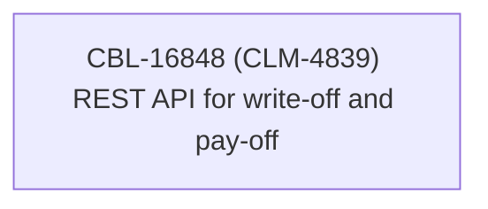

# CBL-16848 (CLM-4839) REST API for write-off and pay-off

- **Diagram Type**: Custom
- **Package**: HomerSelect/BSL/Modules/Contract Management (COMA)/Requirements/CBL-16848 (CLM-4839) REST API for write-off and pay-off
- **Diagram ID**: 156104
- **Elements**: 1
- **Connectors**: 0

