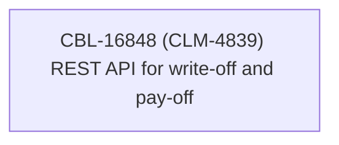

# CBL-16848 (CLM-4839) REST API for write-off and pay-off

```mermaid
graph TD
    CBL_16848_CLM_4839_REST_API_for_write_off_and_pay_off["CBL-16848 (CLM-4839) REST API for write-off and pay-off"]
```
