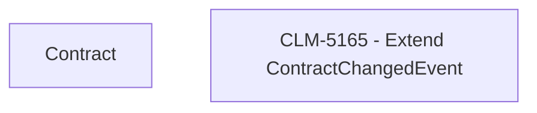

# CLM-5165 - Extend ContractChangedEvent

- **Diagram Type**: Custom
- **Package**: HomerSelect/BSL/Modules/Contract Management (COMA)/Requirements/CBL-17316/CLM-5165 - Extend ContractChangedEvent
- **Diagram ID**: 156246
- **Elements**: 2
- **Connectors**: 0

