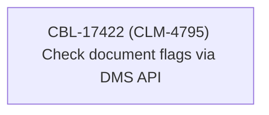

# CBL-17422 (CLM-4795) Check document flags via DMS API

- **Diagram Type**: Custom
- **Package**: HomerSelect/BSL/Modules/Contract Management (COMA)/Requirements/CBL-17422 (CLM-4795) Check document flags via DMS API
- **Diagram ID**: 156105
- **Elements**: 1
- **Connectors**: 0

