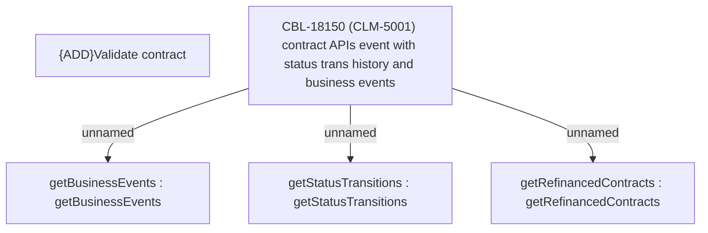

# CBL-18150 (CLM-5001) contract APIs event with status trans history and business events

- **Diagram Type**: Custom
- **Package**: HomerSelect/BSL/Modules/Contract Management (COMA)/Requirements/CBL-18150 (CLM-5001) contract APIs event with status trans history and business events
- **Diagram ID**: 156106
- **Elements**: 5
- **Connectors**: 3

