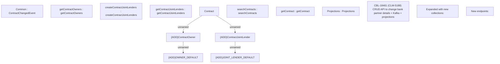

# CBL-18461 (CLM-5188) CRUD API to change bank partner details + Kafka + projections

- **Diagram Type**: Custom
- **Package**: HomerSelect/BSL/Modules/Contract Management (COMA)/Requirements/CBL-18461 (CLM-5188) CRUD API to change bank partner details + Kafka + projections
- **Diagram ID**: 156110
- **Elements**: 15
- **Connectors**: 4

