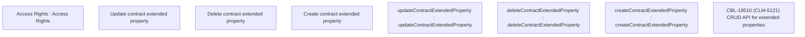

# CBL-18510 (CLM-5121) CRUD API for extended properties

```mermaid
graph TD
    Access_Rights_Access_Rights["Access Rights : Access Rights"]
    Update_contract_extended_property["Update contract extended property"]
    Delete_contract_extended_property["Delete contract extended property"]
    Create_contract_extended_property["Create contract extended property"]
    updateContractExtendedProperty_updateContractExtendedPropert["updateContractExtendedProperty : updateContractExtendedProperty"]
    deleteContractExtendedProperty_deleteContractExtendedPropert["deleteContractExtendedProperty : deleteContractExtendedProperty"]
    createContractExtendedProperty_createContractExtendedPropert["createContractExtendedProperty : createContractExtendedProperty"]
    CBL_18510_CLM_5121_CRUD_API_for_extended_properties["CBL-18510 (CLM-5121) CRUD API for extended properties"]
```
