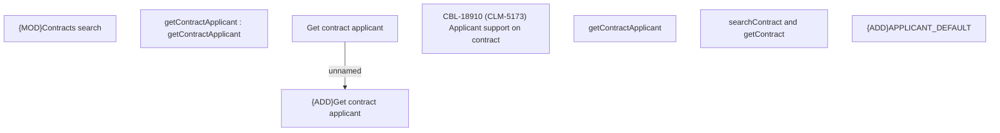

# CBL-18910 (CLM-5173) Applicant support on contract

- **Diagram Type**: Custom
- **Package**: HomerSelect/BSL/Modules/Contract Management (COMA)/Requirements/CBL-18910 Applicant support on contract/CLM-5173
- **Diagram ID**: 156247
- **Elements**: 8
- **Connectors**: 1

