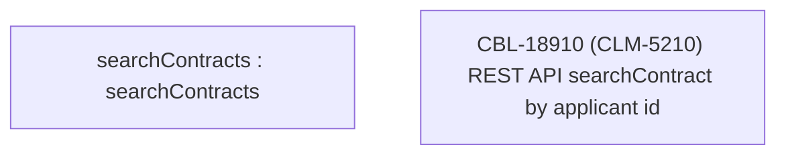

# CBL-18910 (CLM-5210) REST API searchContract by applicant id 

- **Diagram Type**: Custom
- **Package**: HomerSelect/BSL/Modules/Contract Management (COMA)/Requirements/CBL-18910 Applicant support on contract/CLM-5210
- **Diagram ID**: 156249
- **Elements**: 2
- **Connectors**: 0

