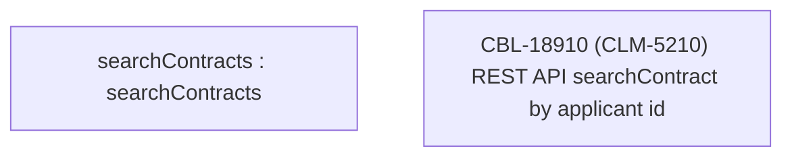

# CBL-18910 (CLM-5210) REST API searchContract by applicant id 

```mermaid
graph TD
    searchContracts_searchContracts["searchContracts : searchContracts"]
    CBL_18910_CLM_5210_REST_API_searchContract_by_applicant_id["CBL-18910 (CLM-5210) REST API searchContract by applicant id "]
```
