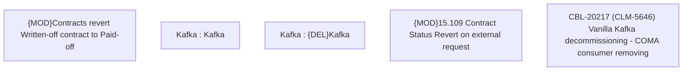

# CBL-20217 (CLM-5646) Vanilla Kafka decommissioning - COMA consumer removing

```mermaid
graph TD
    MOD_Contracts_revert_Written_off_contract_to_Paid_off["{MOD}Contracts revert Written-off contract to Paid-off"]
    Kafka_Kafka["Kafka : Kafka"]
    Kafka_DEL_Kafka["Kafka : {DEL}Kafka"]
    MOD_15_109_Contract_Status_Revert_on_external_request["{MOD}15.109 Contract Status Revert on external request"]
    CBL_20217_CLM_5646_Vanilla_Kafka_decommissioning_COMA_consum["CBL-20217 (CLM-5646) Vanilla Kafka decommissioning - COMA consumer removing"]
```
