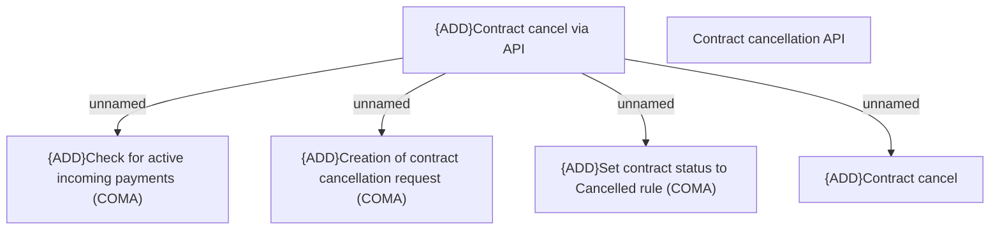

# CBL-23420 (CLM-6038) Contract cancellation API

- **Diagram Type**: Custom
- **Package**: HomerSelect/BSL/Modules/Contract Management (COMA)/Requirements/CBL-23420 (CLM-6038) Contract cancellation API
- **Diagram ID**: 156887
- **Elements**: 6
- **Connectors**: 4

