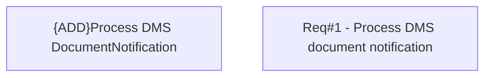

# CBL-30572 (CLM-7349) Process DMS document notification

- **Diagram Type**: Custom
- **Package**: HomerSelect/BSL/Modules/Contract Management (COMA)/Requirements/CBL-30572 (CLM-7349) Process DMS document notification
- **Diagram ID**: 164645
- **Elements**: 2
- **Connectors**: 0

