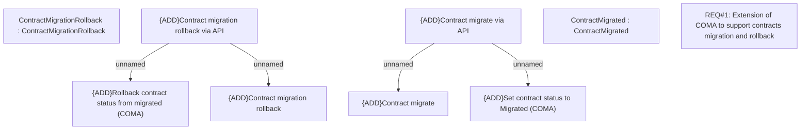

# CBL-31177 (CLM-7630) Migrated contract support

```mermaid
graph TD
    ContractMigrationRollback_ContractMigrationRollback["ContractMigrationRollback : ContractMigrationRollback"]
    ADD_Rollback_contract_status_from_migrated_COMA["{ADD}Rollback contract status from migrated (COMA)"]
    ADD_Contract_migration_rollback["{ADD}Contract migration rollback"]
    ADD_Contract_migration_rollback_via_API["{ADD}Contract migration rollback via API"]
    ADD_Contract_migrate["{ADD}Contract migrate"]
    ADD_Set_contract_status_to_Migrated_COMA["{ADD}Set contract status to Migrated (COMA)"]
    ADD_Contract_migrate_via_API["{ADD}Contract migrate via API"]
    ContractMigrated_ContractMigrated["ContractMigrated : ContractMigrated"]
    REQ_1_Extension_of_COMA_to_support_contracts_migration_and_r["REQ#1: Extension of COMA to support contracts migration and rollback"]
    ADD_Contract_migrate_via_API -->|unnamed| ADD_Contract_migrate
    ADD_Contract_migrate_via_API -->|unnamed| ADD_Set_contract_status_to_Migrated_COMA
    ADD_Contract_migration_rollback_via_API -->|unnamed| ADD_Rollback_contract_status_from_migrated_COMA
    ADD_Contract_migration_rollback_via_API -->|unnamed| ADD_Contract_migration_rollback
```
