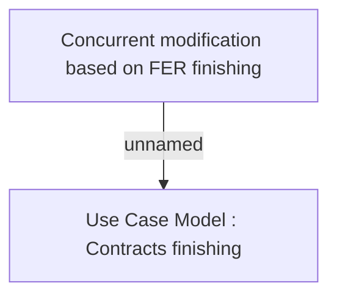

# CLM-4771 Concurrent modification based on FER finishing

- **Diagram Type**: Custom
- **Package**: HomerSelect/BSL/Modules/Contract Management (COMA)/Requirements/CLM-4771 Concurrent modification based on FER finishing
- **Diagram ID**: 156124
- **Elements**: 2
- **Connectors**: 1

