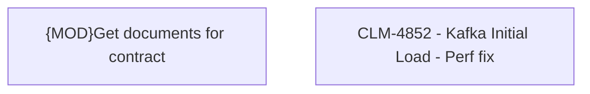

# CLM-4852 - Kafka Initial Load - Perf fix

- **Diagram Type**: Custom
- **Package**: HomerSelect/BSL/Modules/Contract Management (COMA)/Requirements/CLM-4852 - Kafka Initial Load - Perf fix
- **Diagram ID**: 156126
- **Elements**: 2
- **Connectors**: 0

