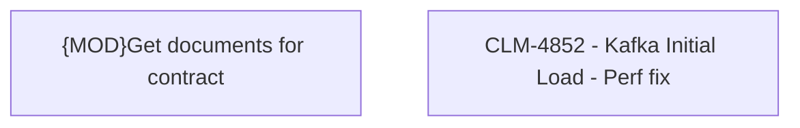

# CLM-4852 - Kafka Initial Load - Perf fix

```mermaid
graph TD
    MOD_Get_documents_for_contract["{MOD}Get documents for contract"]
    CLM_4852_Kafka_Initial_Load_Perf_fix["CLM-4852 - Kafka Initial Load - Perf fix"]
```
