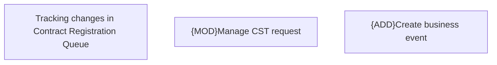

# Business Rules

- **Diagram Type**: Custom
- **Package**: HomerSelect/BSL/Modules/Contract Management (COMA_NG)/Analytical Model/Contract Operations/COMMON for COMA_NG/Business Rules
- **Diagram ID**: 160640
- **Elements**: 3
- **Connectors**: 0

