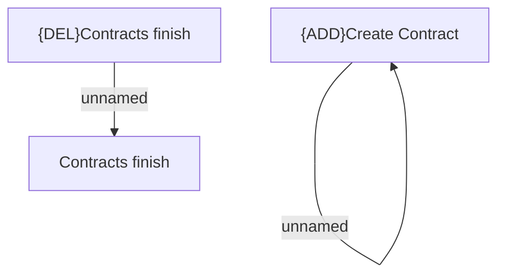

# Access Rights

- **Diagram Type**: Custom
- **Package**: HomerSelect/BSL/Modules/Contract Management (COMA_NG)/Analytical Model/Contract Operations/Finish Contract/Access Rights
- **Diagram ID**: 160193
- **Elements**: 4
- **Connectors**: 2

