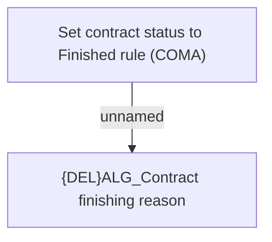

# Business Rules

```mermaid
graph TD
    DEL_ALG_Contract_finishing_reason["{DEL}ALG_Contract finishing reason"]
    Set_contract_status_to_Finished_rule_COMA["Set contract status to Finished rule (COMA)"]
    Set_contract_status_to_Finished_rule_COMA -->|unnamed| DEL_ALG_Contract_finishing_reason
```
