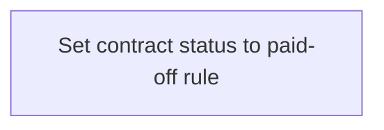

# Business Rules

- **Diagram Type**: Custom
- **Package**: HomerSelect/BSL/Modules/Contract Management (COMA_NG)/Analytical Model/Contract Operations/{DEL}Pay-off Contract/Business Rules
- **Diagram ID**: 160198
- **Elements**: 1
- **Connectors**: 0

