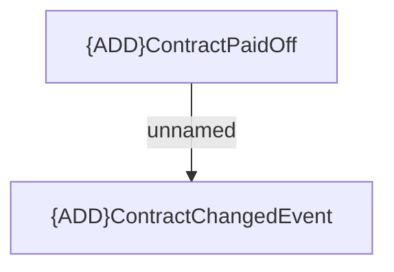

# ContractPaidOff

```mermaid
graph TD
    ADD_ContractChangedEvent["{ADD}ContractChangedEvent"]
    ADD_ContractPaidOff["{ADD}ContractPaidOff"]
    ADD_ContractPaidOff -->|unnamed| ADD_ContractChangedEvent
```
