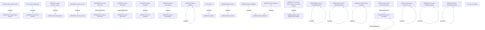

# Access Rights

```mermaid
graph TD
    ADD_Get_contract_commodites["{ADD}Get contract commodites"]
    ADD_Create_Contract_Party["{ADD}Create Contract Party"]
    Get_Contract_Party_Role["Get Contract Party Role"]
    ADD_Create_contract_joint_lenders["{ADD}Create contract joint-lenders"]
    ADD_Get_contract_joint_lenders["{ADD}Get contract joint-lenders"]
    ADD_Get_contract_applicant["{ADD}Get contract applicant"]
    ADD_Get_contract_applicant["{ADD}Get contract applicant"]
    ADD_Update_contract_extended_property["{ADD}Update contract extended property"]
    ADD_Delete_contract_extended_property["{ADD}Delete contract extended property"]
    ADD_Create_contract_extended_property["{ADD}Create contract extended property"]
    ADD_Update_contract_extended_property["{ADD}Update contract extended property"]
    ADD_Delete_contract_extended_property["{ADD}Delete contract extended property"]
    ADD_Create_contract_extended_property["{ADD}Create contract extended property"]
    ADD_Get_contract_extended_properties["{ADD}Get contract extended properties"]
    ADD_Get_contract_status_transitions["{ADD}Get contract status transitions"]
    ADD_Get_contract_extended_properties["{ADD}Get contract extended properties"]
    ADD_Get_contract_status_transitions["{ADD}Get contract status transitions"]
    ADD_Create_contract_business_event["{ADD}Create contract business event"]
    ADD_Create_contract_business_event["{ADD}Create contract business event"]
    ADD_Get_contract_business_events["{ADD}Get contract business events"]
    ADD_Get_business_events["{ADD} Get business events"]
    ADD_Get_contract_account["{ADD} Get contract account"]
    MOD_Get_contract_account["{MOD}Get contract account"]
    ADD_Create_contract_documents_bulk["{ADD}Create contract documents (bulk)"]
    ADD_Create_contract_document["{ADD}Create contract document"]
    ADD_Create_contract_document["{ADD}Create contract document"]
    ADD_Remove_contract_document["{ADD}Remove contract document"]
    ADD_Delete_contract_document["{ADD}Delete contract document"]
    ADD_Get_contract_documents["{ADD}Get contract documents"]
    MOD_Get_contract_documents["{MOD}Get contract documents"]
    ADD_Get_contract_customer["{ADD}Get contract customer"]
    MOD_Get_contract_customer["{MOD}Get contract customer"]
    ADD_Get_contract_commodities["{ADD}Get contract commodities"]
    ADD_Get_contract["{ADD}Get contract"]
    Get_contract["Get contract"]
    ADD_Contracts_validation_v2["{ADD}Contracts validation v2"]
    ADD_Contracts_search["{ADD}Contracts search"]
    MOD_Contracts_search["{MOD}Contracts search"]
    MOD_Contracts_validation["{MOD}Contracts validation"]
    ADD_Contracts_validation["{ADD}Contracts validation"]
    ADD_Contracts_revert_Written_off_to_Paid_off["{ADD}Contracts revert Written-off to Paid-off"]
    MOD_15_109_Contract_Status_Revert_on_external_request["{MOD}15.109 Contract Status Revert on external request"]
    Humans_on_entities["Humans on entities"]
    ADD_Create_contract_document -->|External Reference| ADD_Create_contract_document
    ADD_Create_Contract_Party -->|unnamed| ADD_Create_contract_joint_lenders
    ADD_Create_contract_documents_bulk -->|External Reference| ADD_Create_contract_document
    ADD_Delete_contract_document -->|External Reference| ADD_Remove_contract_document
    MOD_Get_contract_documents -->|External Reference| ADD_Get_contract_documents
    ADD_Get_contract_business_events -->|unnamed| ADD_Get_business_events
    ADD_Get_contract_applicant -->|unnamed| ADD_Get_contract_applicant
    ADD_Update_contract_extended_property -->|unnamed| ADD_Update_contract_extended_property
    ADD_Create_contract_extended_property -->|unnamed| ADD_Create_contract_extended_property
    MOD_Get_contract_account -->|unnamed| ADD_Get_contract_account
    MOD_Contracts_validation -->|unnamed| ADD_Contracts_validation
    ADD_Get_contract_status_transitions -->|unnamed| ADD_Get_contract_status_transitions
    ADD_Create_contract_business_event -->|unnamed| ADD_Create_contract_business_event
    ADD_Get_contract_commodites -->|unnamed| ADD_Get_contract_commodities
    MOD_Contracts_search -->|unnamed| ADD_Contracts_search
    ADD_Contracts_validation_v2 -->|unnamed| ADD_Contracts_validation
    ADD_Delete_contract_extended_property -->|unnamed| ADD_Delete_contract_extended_property
    Get_Contract_Party_Role -->|unnamed| ADD_Get_contract_joint_lenders
    MOD_15_109_Contract_Status_Revert_on_external_request -->|unnamed| ADD_Contracts_revert_Written_off_to_Paid_off
    Get_contract -->|unnamed| ADD_Get_contract
    ADD_Get_contract_extended_properties -->|unnamed| ADD_Get_contract_extended_properties
    MOD_Get_contract_customer -->|unnamed| ADD_Get_contract_customer
```
