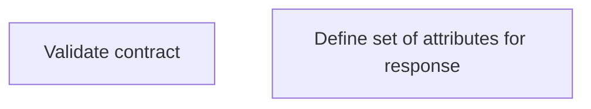

# Business Rules

- **Diagram Type**: Custom
- **Package**: HomerSelect/BSL/Modules/Contract Management (COMA_NG)/Interface Provided/REST/Business Rules
- **Diagram ID**: 163274
- **Elements**: 2
- **Connectors**: 0

