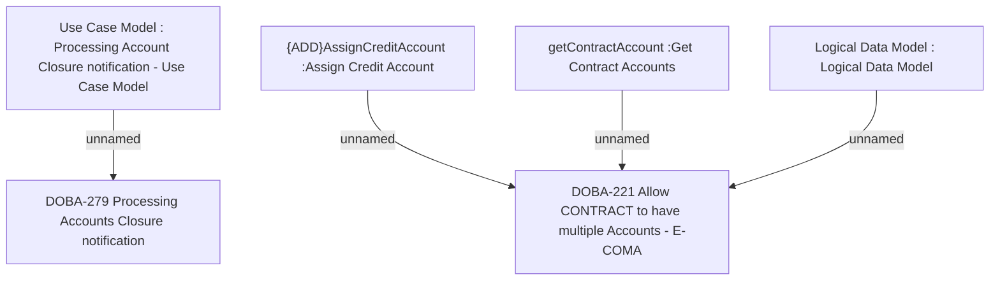

# CBL-29554 Allow CONTRACT to have multiple Accounts

- **Diagram Type**: Custom
- **Package**: HomerSelect/BSL/Modules/Contract Management (COMA_NG)/Requirements/CBL-29554 Allow CONTRACT to have multiple Accounts
- **Diagram ID**: 163144
- **Elements**: 6
- **Connectors**: 4

