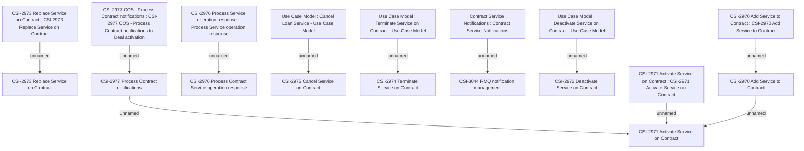

# CBL-22680 Service Management Modules for REL

```mermaid
graph TD
    CSI_2973_Replace_Service_on_Contract_CSI_2973_Replace_Servic["CSI-2973 Replace Service on Contract : CSI-2973 Replace Service on Contract"]
    CSI_2973_Replace_Service_on_Contract["CSI-2973 Replace Service on Contract"]
    CSI_2977_COS_Process_Contract_notifications_CSI_2977_COS_Pro["CSI-2977 COS - Process Contract notifications : CSI-2977 COS - Process Contract notifications to Deal activation"]
    CSI_2977_Process_Contract_notifications["CSI-2977 Process Contract notifications"]
    CSI_2976_Process_Service_operation_response_Process_Service_["CSI-2976 Process Service operation response : Process Service operation response"]
    CSI_2976_Process_Contract_Service_operation_response["CSI-2976 Process Contract Service operation response"]
    CSI_2975_Cancel_Service_on_Contract["CSI-2975 Cancel Service on Contract"]
    Use_Case_Model_Cancel_Loan_Service_Use_Case_Model["Use Case Model : Cancel Loan Service - Use Case Model"]
    Use_Case_Model_Deactivate_Service_on_Contract_Use_Case_Model["Use Case Model : Deactivate Service on Contract - Use Case Model"]
    Use_Case_Model_Terminate_Service_on_Contract_Use_Case_Model["Use Case Model : Terminate Service on Contract - Use Case Model"]
    CSI_2974_Terminate_Service_on_Contract["CSI-2974 Terminate Service on Contract"]
    Contract_Service_Notifications_Contract_Service_Notification["Contract Service Notifications : Contract Service Notifications"]
    CSI_3044_RMQ_notification_management["CSI-3044 RMQ notification management"]
    CSI_2972_Deactivate_Service_on_Contract["CSI-2972 Deactivate Service on Contract"]
    CSI_2971_Activate_Service_on_Contract_CSI_2971_Activate_Serv["CSI-2971 Activate Service on Contract : CSI-2971 Activate Service on Contract"]
    CSI_2970_Add_Service_to_Contract_CSI_2970_Add_Service_to_Con["CSI-2970 Add Service to Contract : CSI-2970 Add Service to Contract"]
    CSI_2971_Activate_Service_on_Contract["CSI-2971 Activate Service on Contract"]
    CSI_2970_Add_Service_to_Contract["CSI-2970 Add Service to Contract"]
    CSI_2970_Add_Service_to_Contract_CSI_2970_Add_Service_to_Con -->|unnamed| CSI_2970_Add_Service_to_Contract
    CSI_2977_Process_Contract_notifications -->|unnamed| CSI_2971_Activate_Service_on_Contract
    CSI_2971_Activate_Service_on_Contract_CSI_2971_Activate_Serv -->|unnamed| CSI_2971_Activate_Service_on_Contract
    CSI_2970_Add_Service_to_Contract -->|unnamed| CSI_2971_Activate_Service_on_Contract
    Use_Case_Model_Deactivate_Service_on_Contract_Use_Case_Model -->|unnamed| CSI_2972_Deactivate_Service_on_Contract
    Contract_Service_Notifications_Contract_Service_Notification -->|unnamed| CSI_3044_RMQ_notification_management
    Use_Case_Model_Terminate_Service_on_Contract_Use_Case_Model -->|unnamed| CSI_2974_Terminate_Service_on_Contract
    Use_Case_Model_Cancel_Loan_Service_Use_Case_Model -->|unnamed| CSI_2975_Cancel_Service_on_Contract
    CSI_2976_Process_Service_operation_response_Process_Service_ -->|unnamed| CSI_2976_Process_Contract_Service_operation_response
    CSI_2977_COS_Process_Contract_notifications_CSI_2977_COS_Pro -->|unnamed| CSI_2977_Process_Contract_notifications
    CSI_2973_Replace_Service_on_Contract_CSI_2973_Replace_Servic -->|unnamed| CSI_2973_Replace_Service_on_Contract
```
