# CSI-3202 - UserRole assignment to contract service

- **Diagram Type**: Custom
- **Package**: HomerSelect/BSL/Modules/Contract Services (COS)/Requirement Model/CBL-22777 SME Project
- **Diagram ID**: 157349
- **Elements**: 14
- **Connectors**: 4

```mermaid
graph TD
    ContractService["ContractService"]
    ADD_Role["{ADD}Role"]
    ADD_08_114_Get_Account_Contract_Service_Role_COS["{ADD}08.114 Get Account Contract Service Role (COS)"]
    ADD_08_112_Deactivate_Role_on_Contract_Service_COS["{ADD}08.112 Deactivate Role on Contract Service (COS)"]
    ADD_08_110_Add_Role_to_Contract_Service_COS["{ADD}08.110 Add Role to Contract Service (COS)"]
    COS_Contract_Service_Role["COS.Contract Service Role"]
    Logical_Data_Model_Logical_Data_Model["Logical Data Model : Logical Data Model"]
    n_08_112_Deactivate_Role_on_Contract_Service_COS["08.112 Deactivate Role on Contract Service (COS)"]
    n_08_110_Add_Role_to_Contract_Service_COS["08.110 Add Role to Contract Service (COS)"]
    n_08_114_Get_Account_Contract_Service_Role_COS["08.114 Get Account Contract Service Role (COS)"]
    Contract_Services_ADD_Get_Account_Contract_Service_Roles_COS["Contract Services : {ADD}Get Account Contract Service Roles (COS)"]
    Contract_Services_ADD_Deactivate_Role_on_Contract_Services_m["Contract Services : {ADD}Deactivate Role on Contract Services method"]
    Contract_Services_ADD_Add_Role_to_Contract_Services_method["Contract Services : {ADD}Add Role to Contract Services method"]
    Schema_Definitions_Schema_Definitions["Schema Definitions : Schema Definitions"]
    ContractService -->|unnamed| ADD_Role
    n_08_114_Get_Account_Contract_Service_Role_COS -->|unnamed| ADD_08_114_Get_Account_Contract_Service_Role_COS
    n_08_110_Add_Role_to_Contract_Service_COS -->|unnamed| ADD_08_110_Add_Role_to_Contract_Service_COS
    n_08_112_Deactivate_Role_on_Contract_Service_COS -->|unnamed| ADD_08_112_Deactivate_Role_on_Contract_Service_COS
```

