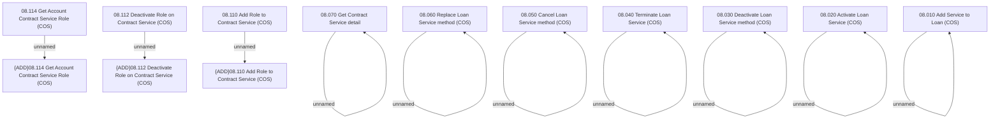

# Access Rights

```mermaid
graph TD
    ADD_08_114_Get_Account_Contract_Service_Role_COS["{ADD}08.114 Get Account Contract Service Role (COS)"]
    ADD_08_112_Deactivate_Role_on_Contract_Service_COS["{ADD}08.112 Deactivate Role on Contract Service (COS)"]
    ADD_08_110_Add_Role_to_Contract_Service_COS["{ADD}08.110 Add Role to Contract Service (COS)"]
    n_08_070_Get_Contract_Service_detail["08.070 Get Contract Service detail"]
    n_08_114_Get_Account_Contract_Service_Role_COS["08.114 Get Account Contract Service Role (COS)"]
    n_08_112_Deactivate_Role_on_Contract_Service_COS["08.112 Deactivate Role on Contract Service (COS)"]
    n_08_110_Add_Role_to_Contract_Service_COS["08.110 Add Role to Contract Service (COS)"]
    n_08_070_Get_Contract_Service_detail["08.070 Get Contract Service detail"]
    n_08_060_Replace_Loan_Service_method_COS["08.060 Replace Loan Service method (COS)"]
    n_08_050_Cancel_Loan_Service_method_COS["08.050 Cancel Loan Service method (COS)"]
    n_08_040_Terminate_Loan_Service_COS["08.040 Terminate Loan Service (COS)"]
    n_08_060_Replace_Loan_Service_method_COS["08.060 Replace Loan Service method (COS)"]
    n_08_050_Cancel_Loan_Service_method_COS["08.050 Cancel Loan Service method (COS)"]
    n_08_040_Terminate_Loan_Service_COS["08.040 Terminate Loan Service (COS)"]
    n_08_030_Deactivate_Loan_Service_method_COS["08.030 Deactivate Loan Service method (COS)"]
    n_08_030_Deactivate_Loan_Service_method_COS["08.030 Deactivate Loan Service method (COS)"]
    n_08_020_Activate_Loan_Service_COS["08.020 Activate Loan Service (COS)"]
    n_08_020_Activate_Loan_Service_COS["08.020 Activate Loan Service (COS)"]
    n_08_010_Add_Service_to_Loan_COS["08.010 Add Service to Loan (COS)"]
    n_08_010_Add_Service_to_Loan_COS["08.010 Add Service to Loan (COS)"]
    n_08_070_Get_Contract_Service_detail -->|unnamed| n_08_070_Get_Contract_Service_detail
    n_08_060_Replace_Loan_Service_method_COS -->|unnamed| n_08_060_Replace_Loan_Service_method_COS
    n_08_110_Add_Role_to_Contract_Service_COS -->|unnamed| ADD_08_110_Add_Role_to_Contract_Service_COS
    n_08_050_Cancel_Loan_Service_method_COS -->|unnamed| n_08_050_Cancel_Loan_Service_method_COS
    n_08_114_Get_Account_Contract_Service_Role_COS -->|unnamed| ADD_08_114_Get_Account_Contract_Service_Role_COS
    n_08_010_Add_Service_to_Loan_COS -->|unnamed| n_08_010_Add_Service_to_Loan_COS
    n_08_030_Deactivate_Loan_Service_method_COS -->|unnamed| n_08_030_Deactivate_Loan_Service_method_COS
    n_08_040_Terminate_Loan_Service_COS -->|unnamed| n_08_040_Terminate_Loan_Service_COS
    n_08_020_Activate_Loan_Service_COS -->|unnamed| n_08_020_Activate_Loan_Service_COS
    n_08_112_Deactivate_Role_on_Contract_Service_COS -->|unnamed| ADD_08_112_Deactivate_Role_on_Contract_Service_COS
```
