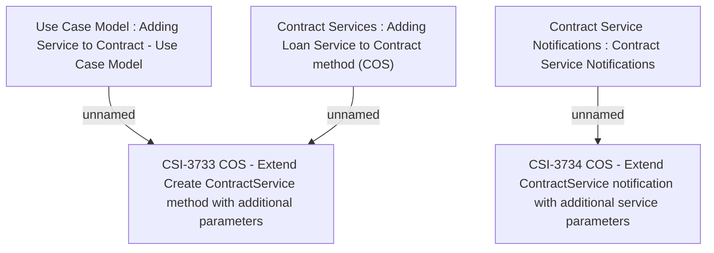

# CBL-27560 BREIT-104 - COS Module Extension

- **Diagram Type**: Custom
- **Package**: HomerSelect/BSL/Modules/Contract Services (COS_NG)/Requirement Model/CBL-27560 BREIT-104 - COS Module Extension
- **Diagram ID**: 160500
- **Elements**: 5
- **Connectors**: 3

