# CBL-29554 Allow CONTRACT to have multiple Accounts

- **Diagram Type**: Custom
- **Package**: HomerSelect/BSL/Modules/Contract Services (COS_NG)/Requirement Model/CBL-29554 Allow CONTRACT to have multiple Accounts
- **Diagram ID**: 163498
- **Elements**: 17
- **Connectors**: 12

```mermaid
graph TD
    Use_Case_Model_Process_Contract_Service_operation_response_U["Use Case Model : Process Contract Service operation response - Use Case Model"]
    DOBA_334_Update_ProcessServiceOperationNotification_function["DOBA-334 Update ProcessServiceOperationNotification function for Account assignment"]
    Use_Case_Model_Get_Contract_Service_detail_Use_Case_Model["Use Case Model : Get Contract Service detail - Use Case Model"]
    DOBA_296_Get_Services_to_related_Account_method["DOBA-296 Get Services to related Account method"]
    Use_Case_Model_Get_Account_Contract_Service_Role_Use_Case_Mo["Use Case Model : Get Account Contract Service Role - Use Case Model"]
    Use_Case_Model_Deactivate_Role_on_Contract_Service_Use_Case_["Use Case Model : Deactivate Role on Contract Service - Use Case Model"]
    Use_Case_Model_Cancel_Loan_Service_Use_Case_Model["Use Case Model : Cancel Loan Service - Use Case Model"]
    Use_Case_Model_Add_Role_to_Contract_Service_Use_Case_Model["Use Case Model : Add Role to Contract Service - Use Case Model"]
    Contract_Service_Notifications_v1_Contract_Service_Notificat["Contract Service Notifications v1 : Contract Service Notifications"]
    Use_Case_Model_Activate_Service_on_Contract_Use_Case_Model["Use Case Model : Activate Service on Contract - Use Case Model"]
    DOBA_292_Contract_Service_management_for_multiple_Accounts_E["DOBA-292 Contract Service management for multiple Accounts - E-COS"]
    Schema_Definitions_Schema_Definitions["Schema Definitions : Schema Definitions"]
    Contract_Services_Adding_Loan_Service_to_Contract_method_COS["Contract Services : Adding Loan Service to Contract method (COS) v1"]
    Contract_Service_Notifications_v1_Contract_Service_Notificat["Contract Service Notifications v1 : Contract Service Notifications"]
    Logical_Data_Model_Logical_Data_Model["Logical Data Model : Logical Data Model"]
    Use_Case_Model_Adding_Service_to_Contract_Use_Case_Model["Use Case Model : Adding Service to Contract - Use Case Model"]
    DOBA_284_Allow_adding_Service_to_defined_Account_E_COS["DOBA-284 Allow adding Service to defined Account - E-COS"]
    Schema_Definitions_Schema_Definitions -->|unnamed| DOBA_284_Allow_adding_Service_to_defined_Account_E_COS
    Contract_Services_Adding_Loan_Service_to_Contract_method_COS -->|unnamed| DOBA_284_Allow_adding_Service_to_defined_Account_E_COS
    Contract_Service_Notifications_v1_Contract_Service_Notificat -->|unnamed| DOBA_284_Allow_adding_Service_to_defined_Account_E_COS
    Logical_Data_Model_Logical_Data_Model -->|unnamed| DOBA_284_Allow_adding_Service_to_defined_Account_E_COS
    Use_Case_Model_Adding_Service_to_Contract_Use_Case_Model -->|unnamed| DOBA_284_Allow_adding_Service_to_defined_Account_E_COS
    Contract_Service_Notifications_v1_Contract_Service_Notificat -->|unnamed| DOBA_292_Contract_Service_management_for_multiple_Accounts_E
    Use_Case_Model_Activate_Service_on_Contract_Use_Case_Model -->|unnamed| DOBA_292_Contract_Service_management_for_multiple_Accounts_E
    DOBA_292_Contract_Service_management_for_multiple_Accounts_E -->|unnamed| Use_Case_Model_Add_Role_to_Contract_Service_Use_Case_Model
    DOBA_292_Contract_Service_management_for_multiple_Accounts_E -->|unnamed| Use_Case_Model_Deactivate_Role_on_Contract_Service_Use_Case_
    DOBA_292_Contract_Service_management_for_multiple_Accounts_E -->|unnamed| Use_Case_Model_Get_Account_Contract_Service_Role_Use_Case_Mo
    Use_Case_Model_Get_Contract_Service_detail_Use_Case_Model -->|unnamed| DOBA_296_Get_Services_to_related_Account_method
    Use_Case_Model_Process_Contract_Service_operation_response_U -->|unnamed| DOBA_334_Update_ProcessServiceOperationNotification_function
```

