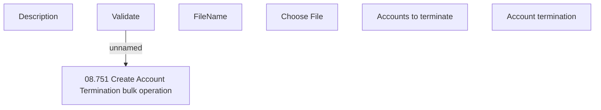

# User Interface Model

```mermaid
graph TD
    Description["Description"]
    n_08_751_Create_Account_Termination_bulk_operation["08.751 Create Account Termination bulk operation"]
    Validate["Validate"]
    FileName["FileName"]
    Choose_File["Choose File"]
    Accounts_to_terminate["Accounts to terminate"]
    Account_termination["Account termination"]
    Validate -->|unnamed| n_08_751_Create_Account_Termination_bulk_operation
```
