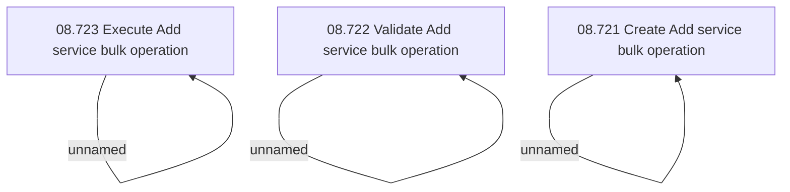

# Access Rights

- **Diagram Type**: Custom
- **Package**: HomerSelect/BSL/Modules/Contract bulk operations (BSA)/Analytical Model/Add service /Access Rights
- **Diagram ID**: 137919
- **Elements**: 6
- **Connectors**: 3

