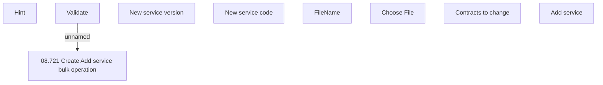

# Add service

```mermaid
graph TD
    n_08_721_Create_Add_service_bulk_operation["08.721 Create Add service bulk operation"]
    Hint["Hint"]
    Validate["Validate"]
    New_service_version["New service version"]
    New_service_code["New service code"]
    FileName["FileName"]
    Choose_File["Choose File"]
    Contracts_to_change["Contracts to change"]
    Add_service["Add service"]
    Validate -->|unnamed| n_08_721_Create_Add_service_bulk_operation
```
