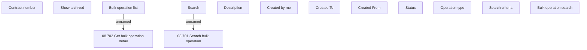

# Bulk operation search

- **Diagram Type**: Custom
- **Package**: HomerSelect/BSL/Modules/Contract bulk operations (BSA)/Analytical Model/COMMON for Contract Bulk Operations/User Interface Model
- **Diagram ID**: 145051
- **Elements**: 15
- **Connectors**: 2

