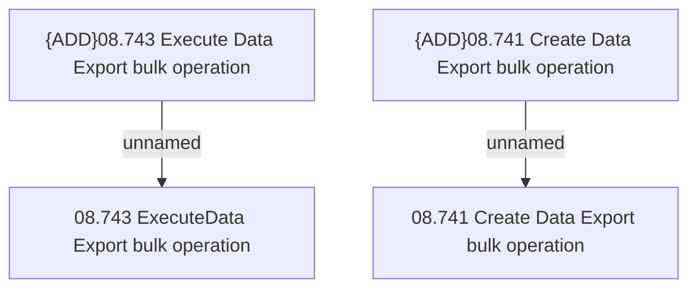

# Access Rights

- **Diagram Type**: Custom
- **Package**: HomerSelect/BSL/Modules/Contract bulk operations (BSA)/Analytical Model/Data Export/Access Rights
- **Diagram ID**: 157729
- **Elements**: 4
- **Connectors**: 2

