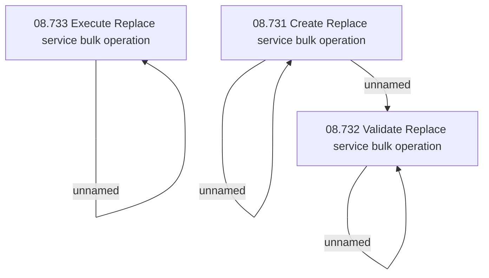

# Access Rights

- **Diagram Type**: Custom
- **Package**: HomerSelect/BSL/Modules/Contract bulk operations (BSA)/Analytical Model/Replace service/Access Rights
- **Diagram ID**: 164327
- **Elements**: 6
- **Connectors**: 4

