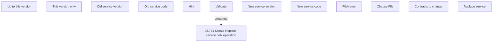

# Replace service

```mermaid
graph TD
    n_08_731_Create_Replace_service_bulk_operation["08.731 Create Replace service bulk operation"]
    Up_to_this_version["Up to this version"]
    This_version_only["This version only"]
    Old_service_version["Old service version"]
    Old_service_code["Old service code"]
    Hint["Hint"]
    Validate["Validate"]
    New_service_version["New service version"]
    New_service_code["New service code"]
    FileName["FileName"]
    Choose_File["Choose File"]
    Contracts_to_change["Contracts to change"]
    Replace_service["Replace service"]
    Validate -->|unnamed| n_08_731_Create_Replace_service_bulk_operation
```
